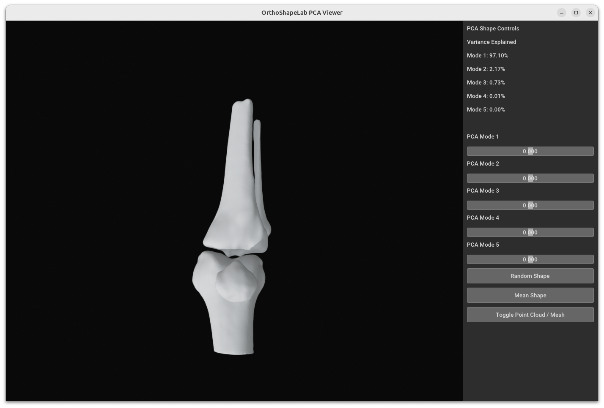

# OrthoShapeLab

**OrthoShapeLab** is an interactive toolkit for **3D Statistical Shape Modeling (SSM)** and visualization of anatomical shape variation.

It allows users to load a set of aligned meshes and explore **shape variation using Principal Component Analysis (PCA)** through an interactive 3D viewer.

The project is designed for **medical imaging, orthopedics, and computational anatomy research**.

---

## Screenshot

<p align="center">
  
</p>

Example of the interactive PCA viewer used to explore variation in 3D anatomical meshes.

---

## Features

- Interactive **3D mesh visualization**
- **Principal Component Analysis (PCA)** for statistical shape modeling
- Real-time **shape deformation using sliders**
- Display **variance explained for each PCA mode**
- Random shape generation
- Reset to mean shape
- Load meshes directly from a folder
- Support for **STL** and **PLY** mesh formats

Future versions will include:

- **Principal Geodesic Analysis (PGA)**
- Multi-bone statistical shape models
- Additional preprocessing tools

---

## Installation

Install using pip:

```bash
pip install orthoshapelab

## Install from source
```bash
git clone https://github.com/prabhat-twr/orthoshapelab.git

cd orthoshapelab
pip install -e .

## Usage

Run the application from the terminal:
```bash 
orthoshapelab

#### After launching, select a folder containing aligned meshes.

The viewer will open and allow you to:

- Adjust PCA sliders  
- Visualize shape variation  
- Generate random shapes  
- Reset to the mean shape  

---

## Input Requirements

The meshes must satisfy the following conditions:

- Meshes should be rigidly aligned  
- Meshes must have point-to-point correspondence  
- All meshes must have the same number of vertices  


---

## Supported File Formats

- `.stl`
- `.ply`

---

## Platform Support

OrthoShapeLab has been developed and tested on **Ubuntu Linux**.

### Tested Environment

- **OS:** Ubuntu 20.04 / 22.04  
- **Python:** 3.9+  
- **Rendering:** Open3D GUI backend  

---

## Windows Support

Windows support has not yet been fully tested.

Because the viewer relies on the **Open3D rendering engine**, some systems may encounter **OpenGL or WGL related issues** depending on GPU drivers and graphics configuration.

Windows users may still attempt installation:

```bash 
pip install orthoshapelab


If problems occur, running the software on **Ubuntu Linux is recommended**.

---

## Technologies Used

- Python  
- Open3D  
- NumPy  
- Scikit-learn  

---

## Example Applications

OrthoShapeLab can be used for:

- Femur statistical shape modeling  
- Shoulder joint modeling (scapula + humerus)  
- Orthopedic implant design  
- Anatomical variability studies  
- Medical imaging research  


---

## Roadmap

Planned improvements:

- PGA implementation  
- Multi-bone SSM support  
- Landmark-based modeling  
- Improved visualization tools  
- Dataset preprocessing utilities  

---

## Author

**Prabhat Tiwari**

Developer working in:

- Computer Vision  
- Medical Imaging  
- Statistical Shape Modeling  

GitHub:  
https://github.com/prabhat-twr

---


